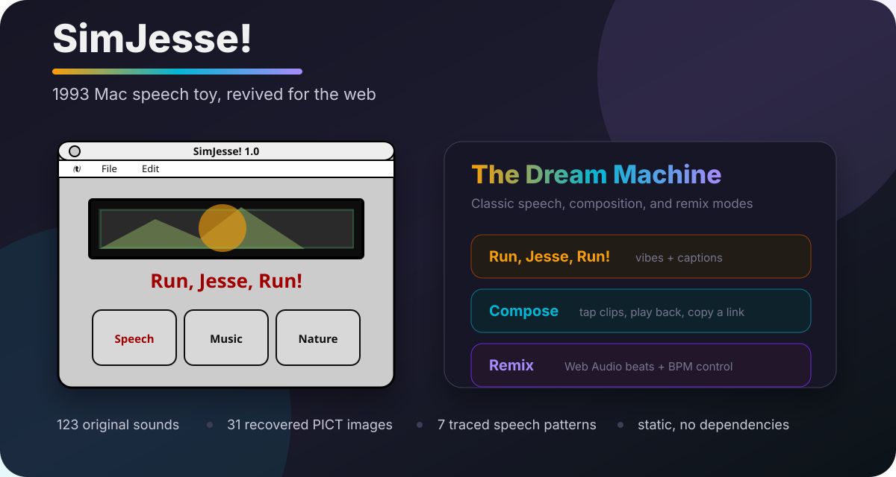

# SimJesse! web re-creation

[](https://github.com/evillollive/sim-jesse/actions/workflows/quality.yml)
[](https://evillollive.github.io/sim-jesse/)
[](LICENSE)
[](#run-it)

**SimJesse!** revives a 1993 classic Mac freeware app as a browser experience: a grammar-aware random speech generator assembled from digitized Jesse Jackson clips, original Mac resources, and a reverse-engineered 68k speech algorithm.

<p align="center">
  <a href="https://evillollive.github.io/sim-jesse/">
    
  </a>
</p>

The original **SimJesse! 1.0 "The Digital Demagogue"** can no longer run on modern hardware. This project preserves the experience by extracting the Mac resource fork, decoding MACE 3:1 audio, recovering the artwork, and porting the original sentence-generation logic into dependency-free web pages.

## Why it is interesting

- **Digital preservation:** keeps a small 1990s Mac culture artifact usable without emulators.
- **Reverse engineering:** documents resource-fork extraction, PICT conversion, MACE audio decoding, and 68k control-flow tracing.
- **Sound collage:** turns 123 recovered clips into continuous pseudo-speeches, a compose mode, and a remix mode.
- **Easy to share:** the classic recreation is a single self-contained HTML file; the modern version runs from static hosting.

## Run it

| Goal | Command or link |
| --- | --- |
| Try the classic web recreation | Open <https://evillollive.github.io/sim-jesse/> |
| Try Version 2.0, "The Dream Machine" | Open <https://evillollive.github.io/sim-jesse/v2/> |
| Run the classic file locally | Open `index.html` in a modern browser |
| Run all static files locally | `python3 -m http.server 8000`, then open <http://localhost:8000/> |

The classic `index.html` embeds its art and sounds directly, so it works without a build step, package manager, or server. Version 2.0 loads WAV files from `extracted/sounds_wav/`; use GitHub Pages or a local static server if your browser blocks local `file://` audio fetches.

## Feature highlights

### Classic SimJesse! 1.0 recreation

- Original Apple / File / Edit menu structure, including **About SimJesse!** under the Apple menu.
- Three original-style controls:
  - **Run, Jesse, Run!** generates continuous speeches until stopped.
  - **Music** loops instrument and musician samples.
  - **Nature** loops nature sounds seamlessly.
- Preserved event sounds: startup is represented by `lou` ("Here comes Jesse Jackson"), and Stop plays `noNo` ("no more!").

### Version 2.0: "The Dream Machine"

`v2/index.html` is a modern reimagining built from the same 123 clips and seven recovered speech patterns:

- **Run, Jesse, Run!** adds scrolling animated captions and vibe filters: Hopeful, Fired Up, Reflective, and Celebration.
- **Compose** lets you tap clips onto a timeline, play them back, and copy a shareable URL.
- **Remix** layers Jesse speech over synthesized beats in Gospel, Lo-fi, Jazz, and Hip-hop modes with a BPM control.

## How it works

1. **Resource fork recovery:** the preserved Mac app archive includes an AppleDouble resource fork, extracted into `SimJesse.rsrc`.
2. **Resource dumping:** custom Python tooling parses the classic Mac resource map into sounds, PICT images, menus, dialogs, code, and data.
3. **Audio decoding:** 120 of 123 clips are Apple MACE 3:1 compressed `'snd '` resources; the tools wrap them as AIFF-C `MAC3` so `ffmpeg` can decode WAV files.
4. **Artwork conversion:** PICT resources get a QuickTime-compatible 512-byte header before conversion to PNG.
5. **Speech algorithm port:** the original 68k `CODE/2.bin` was traced to recover seven random speech patterns, sound pools, branching behavior, and the shared coda.

Read the detailed preservation notes in [docs/REVERSE_ENGINEERING.md](docs/REVERSE_ENGINEERING.md).

## Repository map

| Path | Purpose |
| --- | --- |
| `index.html` | Faithful, self-contained SimJesse! 1.0 browser recreation |
| `v2/index.html` | Version 2.0 "The Dream Machine" with classic, compose, and remix modes |
| `original/` | Original Mac app archive and extracted raw resource fork |
| `extracted/sounds_snd_raw/` | All 123 original `'snd '` resources, named by id and resource name |
| `extracted/sounds_wav/` | Decoded WAV versions of the sound resources |
| `extracted/images_pict_raw/` | Raw PICT resources |
| `extracted/images_png/` | Converted PNG artwork, including portrait and UI assets |
| `tools/` | Resource extraction, decoding, conversion, and static quality checks |
| `docs/SHARING.md` | Positioning, demo ideas, topic suggestions, and share-ready copy |

## Commands and caveats

```bash
# Static security/accessibility baseline used by GitHub Actions
python3 tools/quality_checks.py

# Serve the repo locally for v2 audio fetches
python3 -m http.server 8000
```

Rebuilding the extracted assets from scratch requires Python 3, `ffmpeg` for MACE audio decoding, and ImageMagick for PICT conversion:

```bash
unzip "original/SimJesse 1.0.zip" -d _work
python3 tools/1_extract_resource_fork.py "_work/__MACOSX/._SimJesse 1.0" SimJesse.rsrc
python3 tools/2_dump_resources.py SimJesse.rsrc res
python3 tools/3_decode_sounds.py res/snd wav
tools/4_convert_pict.sh res/PICT png
```

## Privacy, security, and trust

SimJesse is static web content: no backend, no package dependencies, no analytics, and no user accounts. The classic page embeds all media in `index.html` and includes Content Security Policy and referrer-policy meta tags checked by `tools/quality_checks.py`. Version 2.0 fetches local WAV files and uses the clipboard only when you press **Copy Link** in Compose mode.

The original **SimJesse! 1.0** was © 1993 Mark Hayes (ccmlh@it.bu.edu), distributed as freeware with "Please distribute!" language and dedicated to Captain Crunch, the Multicultural Caffeinated Cockatiel. This re-creation is a preservation tribute to Jesse Jackson's oratory and the creativity of the original Mac freeware scene.

## Share it

Useful search phrases: **SimJesse web recreation**, **1993 Mac app preservation**, **classic Mac resource fork reverse engineering**, **MACE 3:1 audio decoding**, **browser-based vintage Mac app recreation**, **Jesse Jackson speech generator**.

If this kind of web preservation is your thing, try the live demo, star the repo, and share it with people interested in classic Mac software, audio archaeology, creative coding, or small weird web toys.

## License

This re-creation is licensed under the [GNU Affero General Public License v3.0](LICENSE).
